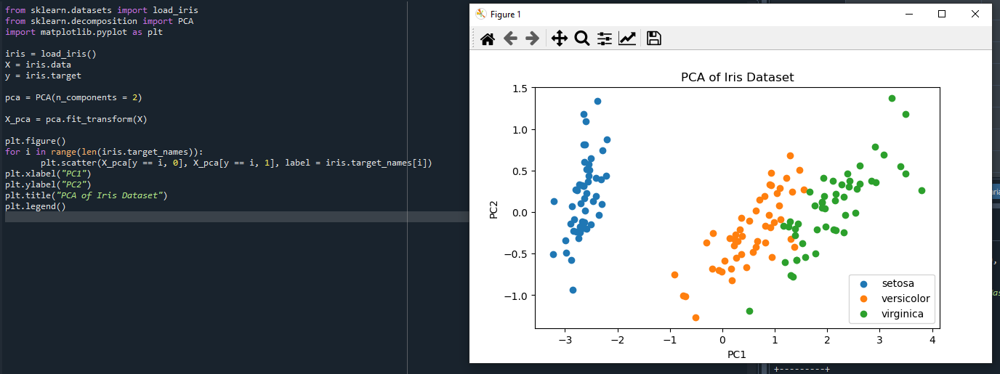
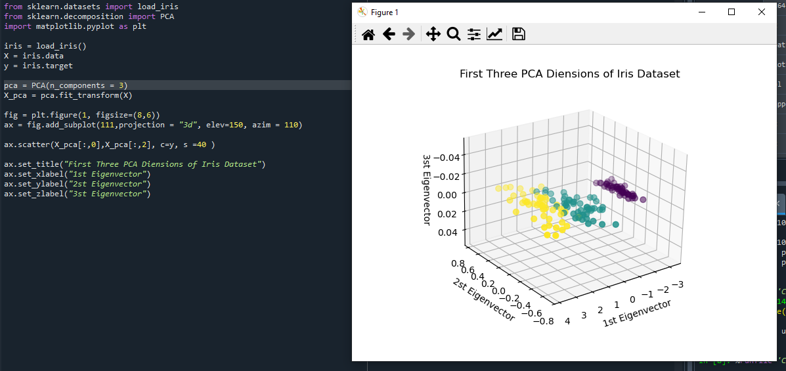
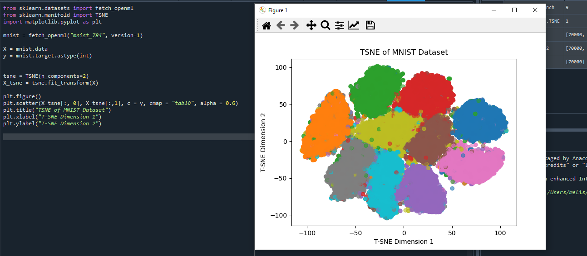

# 📉 Dimension Reduction

This folder contains practical implementations of popular dimensionality reduction techniques — PCA (Principal Component Analysis), LDA (Linear Discriminant Analysis), t-SNE (t-Distributed Stochastic Neighbor Embedding), and a comparison between PCA and LDA.
These methods are essential for simplifying high-dimensional data while preserving important patterns and structures.

## 🚀 Objective

To reduce the number of features in a dataset for better visualization, computational efficiency, and model performance, without losing critical information.

## 🧩 Topics Covered
1️⃣ Principal Component Analysis (PCA)
-
Unsupervised linear technique.
Projects data onto orthogonal directions (principal components) that maximize variance.
Often used for feature extraction, noise reduction, and visualization.

2️⃣ Linear Discriminant Analysis (LDA)
-
Supervised linear technique.
Finds feature combinations that best separate predefined classes.
Maximizes between-class variance and minimizes within-class variance.

3️⃣ t-SNE (t-Distributed Stochastic Neighbor Embedding)
-
Non-linear dimensionality reduction technique.
Preserves local relationships and cluster structures.
Commonly used for visualizing high-dimensional data (e.g., embeddings or image features) in 2D or 3D.

4️⃣ PCA vs LDA
-
PCA: Maximizes data variance, works without labels.
LDA: Maximizes class separability, requires labels.
Comparison file includes visual and quantitative evaluations on the same dataset.
