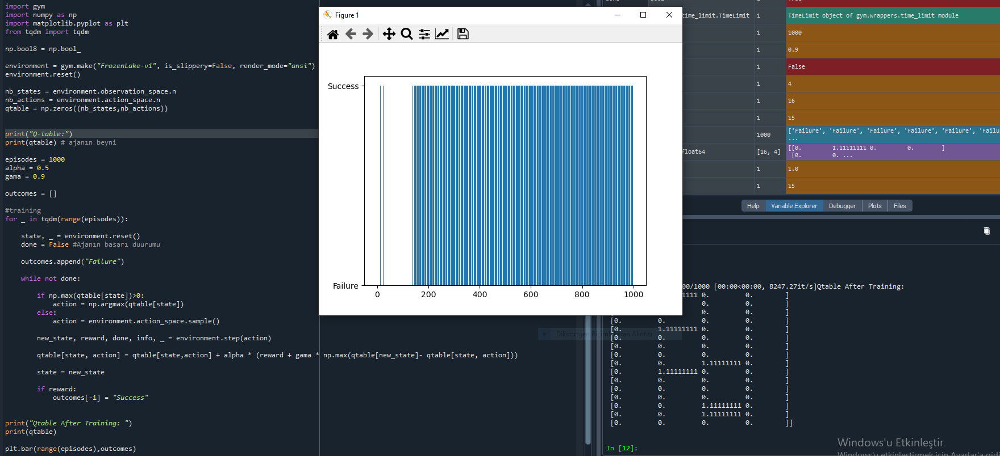
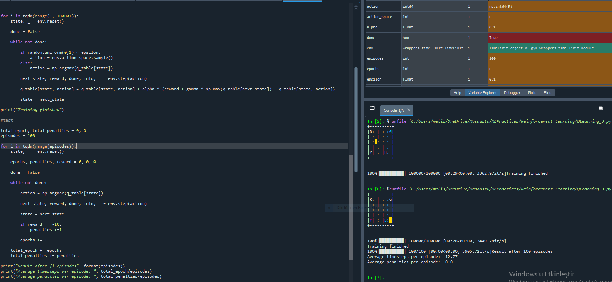

# 🧠 Reinforcement Learning

This project demonstrates one of the fundamental algorithms in Reinforcement Learning — Q-Learning.
The goal is to train an agent that learns to take optimal actions in an environment based on rewards it receives.

------------------------------------------

## 🚀 Objective

Q-Learning is a model-free, off-policy algorithm.
The agent interacts with the environment and learns an optimal policy by updating a Q-table (state–action table) that estimates the expected reward for each action in each state.

## 🧩 Key Concepts

- State: The current situation or position of the agent.

- Action: The possible move or decision the agent can make.

- Reward: The feedback signal received after taking an action.

- Q-Table: A table that stores Q-values (expected rewards) for each state–action pair.

- Learning Rate (α): Determines how much new information overrides old information.

- Discount Factor (γ): Defines how much future rewards are valued compared to immediate ones.

- Exploration vs. Exploitation (ε): The balance between trying new actions and choosing the best-known action.