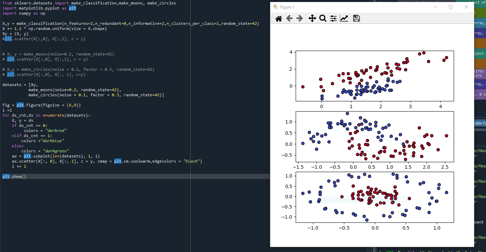

# Supervised Learning Case Study
## 📌 Overview

This repository contains supervised learning practices and case studies.
Supervised learning is a machine learning approach where models are trained using labeled data to make predictions or classifications.All codes were developed and tested using Spyder IDE (Anaconda).
### K-Nearest Neighbors (KNN)

### Decision Tree

### Random Forest

### Classification Model Comparison

### Linear Regression

### Multivariable Linear Regression

### Polynomial Regression

## 🎯 Objectives

Understand the basics of supervised learning.

Apply different algorithms to real-world datasets.

Compare performance metrics of models.

## 🧩 Methods Used

Classification (e.g., Logistic Regression, Decision Trees, Random Forests, KNN, SVM, Naive Bayes)

Regression (e.g., Linear Regression, Polynomial Regression)

## 📊 Evaluation Metrics

Accuracy, Precision, Recall, F1-score (for classification)

Mean Squared Error (MSE), Root Mean Squared Error (RMSE), R² (for regression)