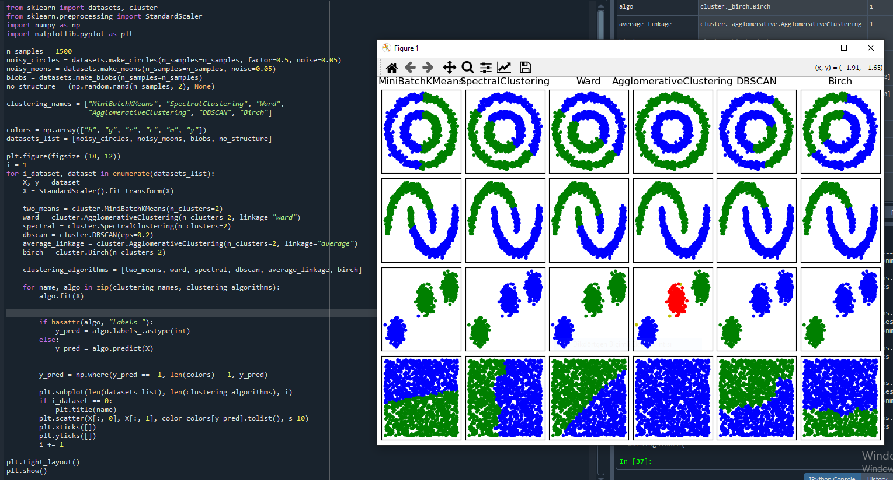
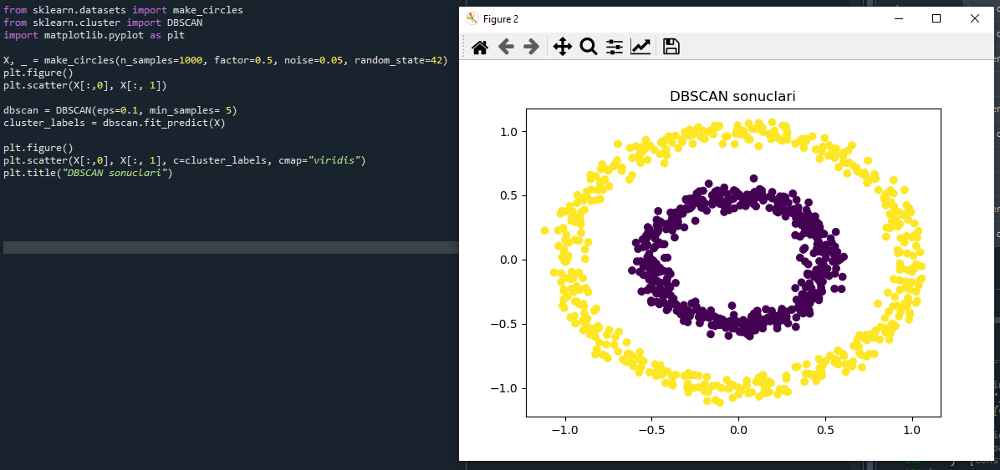
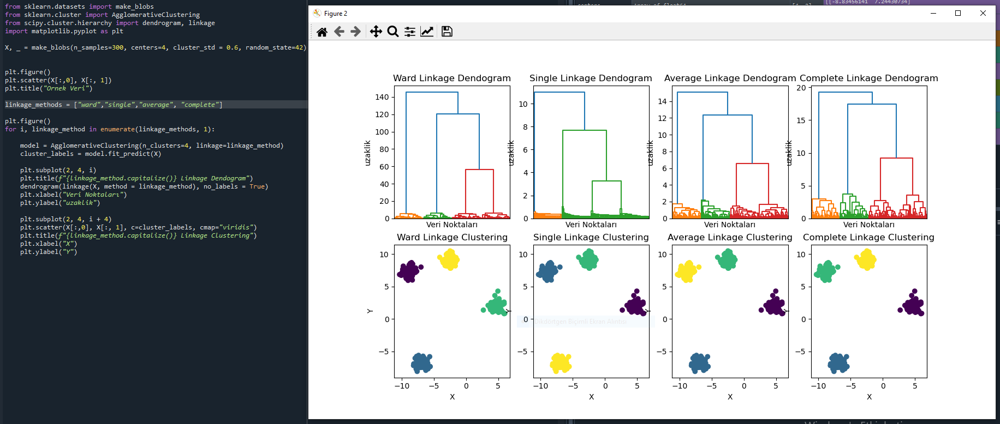
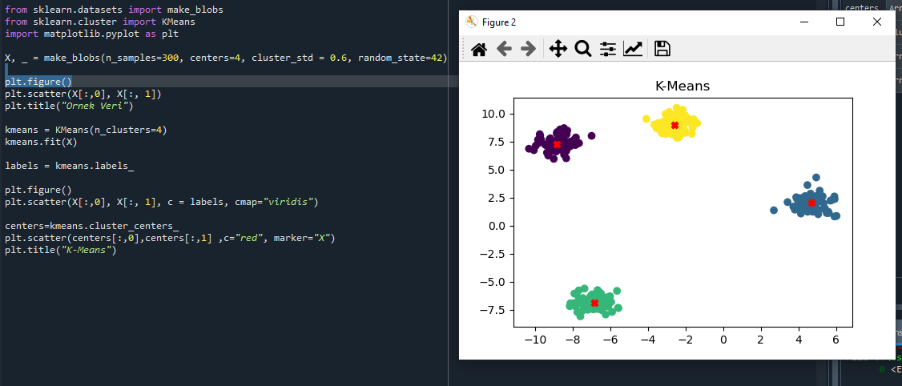

# 🧠 Unsupervised Learning 

This repository contains practical implementations and comparisons of unsupervised learning techniques, specifically focusing on clustering algorithms such as DBSCAN and Hierarchical Clustering.

### Clustering Algorithms Comparison

### DBSCAN

### Hierarchical Clustering

### KMeans Clustering

## 🧩 Topics Covered

Unsupervised Learning Concepts

Clustering Algorithms Overview

DBSCAN (Density-Based Spatial Clustering of Applications with Noise)

Hierarchical Clustering (Agglomerative)

Clustering Algorithms Comparison

Visualization of Decision Boundaries and Clusters

## ⚙️ Technologies & Libraries

- Python

- Pandas

- NumPy

- Matplotlib

- Scikit-learn

## 🧪 Implemented Experiments

Generated datasets using make_moons, make_circles, and blobs

Applied and compared DBSCAN and Hierarchical Clustering

Visualized clustering results and analyzed algorithmic differences

## 📊 Key Learnings

DBSCAN effectively detects clusters of arbitrary shapes and identifies noise.

Hierarchical Clustering provides a clear dendrogram structure but may struggle with overlapping clusters.

Different parameter settings can significantly affect clustering outcomes.